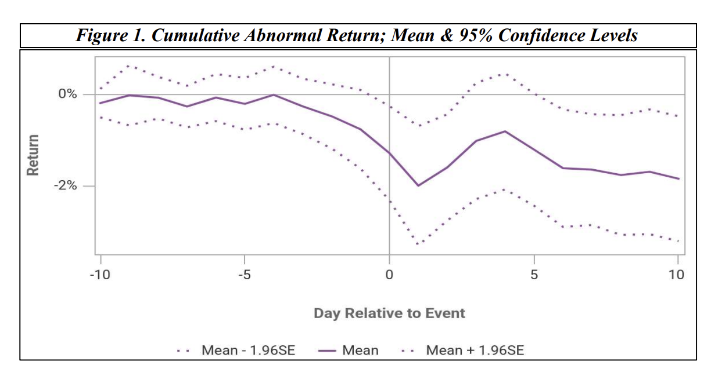

# Bank Failure Contagion — Event Study (Fama-French Three Factor)

- **Status:** Co-authored
- **Tools:** WRDS U.S. Daily Event Study tool, Fama-French Three Factor Model

## Overview
Examined whether U.S. commercial bank failures (2015–2025) produce negative abnormal
returns in geographically proximate, publicly traded banks. Used the WRDS U.S. Daily
Event Study tool with a Fama-French Three Factor expected-return model, a [-150,-50]
estimation window, and a [-10,+10] event window across 97 valid events (37 underlying
bank failures).

*Mean cumulative abnormal return across the [-10,+10] event window. The sharp drop
following Day 0 reflects a statistically significant negative market reaction to nearby
bank failures.*

## Key Findings
- Cumulative abnormal returns (CAR) turned significantly negative at the announcement day
  (t = -2.44, p<0.05) and reached peak significance one day after (t = -3.00, p<0.01)
- Effects intensified immediately post-announcement, suggesting markets price in
  regional spillover risk quickly rather than gradually

## Geographic Distribution of Bank Failures

| Region | Failures | % of Total |
|---|---|---|
| Midwest | 14 | 38% |
| South | 13 | 35% |
| Northeast | 5 | 14% |
| West | 5 | 14% |

Failures concentrated in regions with a higher density of small/mid-sized community
banks, consistent with a localized-contagion hypothesis.

## Files
- `Bank_Failure_Contagion_Event_Study.pdf` — full paper

[← Back to Quant Research Projects](../)
