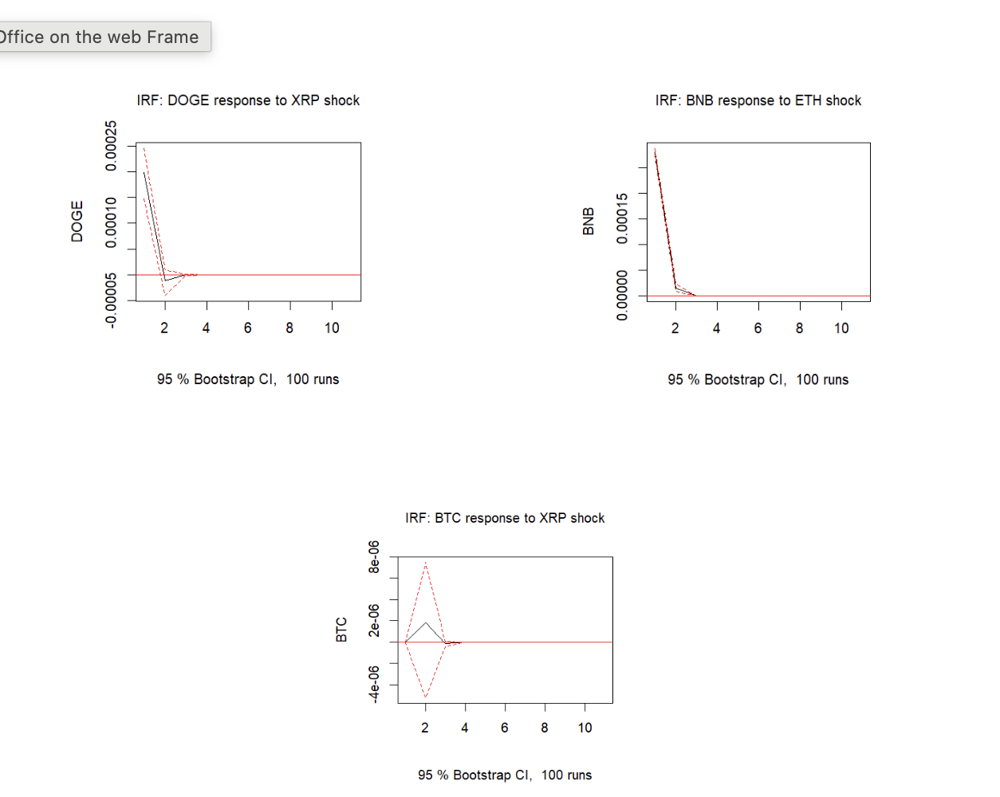
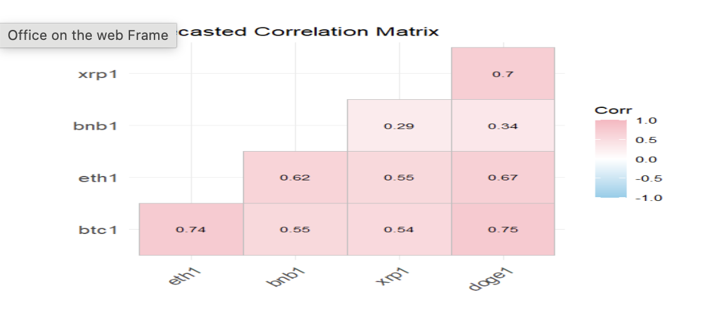

# Cryptocurrency Market Interdependence — VAR & DCC-GARCH Modeling

- **Date:** May 2025
- **Status:** Complete (individual project, QFE 5340 Financial Econometrics)
- **Tools:** R (vars, rmgarch, data.table, ggplot2)

## Overview
Analyzed the dependence structure among five major cryptocurrencies — Bitcoin (BTC),
Ethereum (ETH), Binance Coin (BNB), Ripple (XRP), and Dogecoin (DOGE) — using
high-frequency one-minute return data (100,489 observations per asset). Modeled return
spillovers with a VAR(1) model and time-varying correlations with a DCC-GARCH(1,1) model.

## Return Spillovers — VAR(1)
Fitted a VAR(1) model to capture short-term interdependencies between the five assets.
Diagnostic tests (Portmanteau, ARCH-LM, Jarque-Bera) confirmed VAR residuals exhibit
autocorrelation, heteroskedasticity, and non-normality — motivating the move to a
volatility-aware model.

*DOGE shows a significant positive response to XRP shocks at lag 1, decaying by lag 3.
BNB shows a strong, short-lived response to ETH shocks. XRP's effect on BTC is not
statistically significant.*

## Time-Varying Correlations — DCC-GARCH(1,1)
Converted to hourly returns and estimated a DCC-GARCH(1,1) model to capture how
correlations between cryptocurrencies evolve over time. Volatility persistence (β) is
significant and high for BTC, ETH, XRP, and DOGE (0.78–0.91); BNB shows weaker results,
with an insignificant shock-response (α) parameter.

*All five cryptocurrencies are positively correlated in the short-term forecast. BTC-DOGE
(0.75) and BTC-ETH (0.74) are the most synchronized pairs. BNB is the most independent —
particularly versus XRP (0.29) — suggesting it offers the only meaningful diversification
benefit within this set.*

## Key Findings
- BTC significantly predicts both XRP and DOGE returns in the VAR(1) model
- Crypto correlations are dynamic, not constant — diversification benefits shift over time
  rather than holding steady
- BNB consistently behaves as the outlier, offering the strongest diversification value
  against the other four, which move closely together

## Files
- `Cryptocurrency_Market_Interdependence.docx` — full paper
- `VAR_IRF_Code.R` — VAR(1) estimation, diagnostics, FEVD, impulse response functions
- `DCC_GARCH_Code.R` — DCC-GARCH(1,1) estimation and correlation forecasting

[← Back to Quant Research Projects](../)
