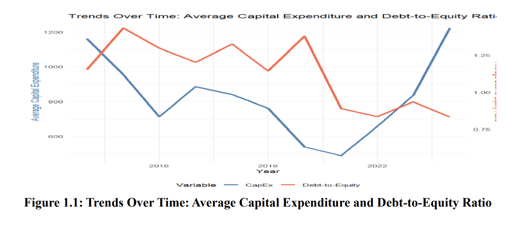
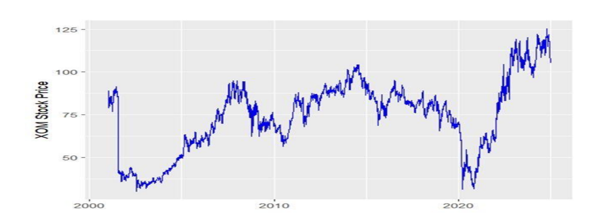
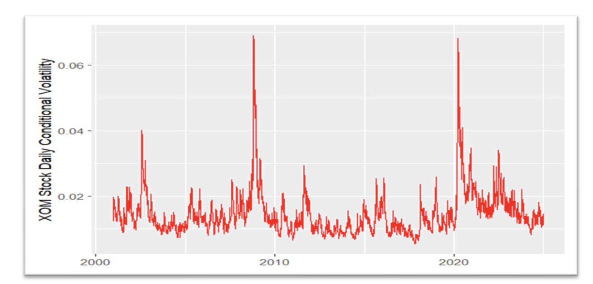
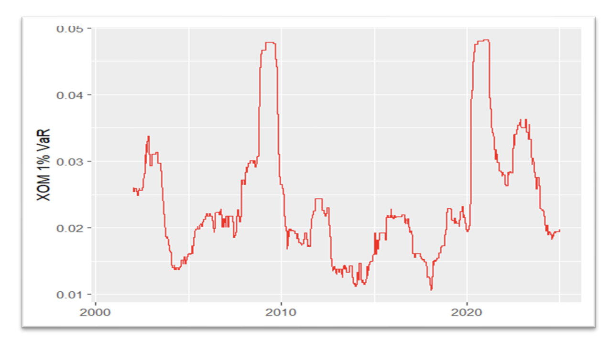

# Firm Investment & Volatility Modeling — U.S. Energy Sector

- **Status:** Co-authored
- **Tools:** R (fixest, rugarch/rmgarch, data.table, ggplot2)

## Overview
Two-part study: (1) panel fixed-effects regression on capex drivers across U.S. energy
firms, and (2) time-series volatility modeling on ExxonMobil (XOM) stock returns.

## Part 1 — Panel Data: Capex Drivers
Fixed-effects regression on 247 U.S. energy firms (1,735 firm-years, 2014–2024) modeling
capital expenditure as a function of leverage, firm size, and lagged capex, winsorized at
the 1%/99% level to control for outliers.

| Model | Time/Firm Effects | Industry Cluster | R² |
|---|---|---|---|
| Model 1 | No | No | 88.00% |
| Model 2 | Yes | No | 94.09% |
| Model 3 | Yes | Yes | 94.09% |

*Average capital expenditure and debt-to-equity ratio, 2014–2024.*

Leverage, firm size, and lagged capex are all significant positive predictors of capex.

## Part 2 — Time Series: ExxonMobil Volatility
ARFIMA(1,0,1)/sGARCH(1,1) and APARCH(1,1) models on 20+ years of XOM daily returns.

*XOM daily stock price and returns, 2000–2024.*

- Volatility clustering confirmed (α+β ≈ 0.99 — past variance strongly predicts future variance)
- Significant leverage/asymmetry effect (γ = 0.283, p<0.01) — negative shocks increase
  volatility more than positive shocks of the same size
- 1% daily Value-at-Risk (~5%, peaking near 5% during 2008 and 2020) and Expected
  Shortfall (~7% in crisis periods)

*Conditional volatility from the APARCH(1,1) model, capturing asymmetric responses to
positive vs. negative shocks.*

*Daily 1% VaR over time, peaking near 5% during the 2008 financial crisis and 2020 COVID shock.*

## Files
- `Energy_Sector_Capex_Volatility.pdf` — full paper
- `Panel_Regression_Capex_Code.R` — Part 1 panel fixed-effects regression
- `XOM_Volatility_Code.r` — Part 2 ARFIMA-GARCH/APARCH volatility modeling

[← Back to Quant Research Projects](../)
