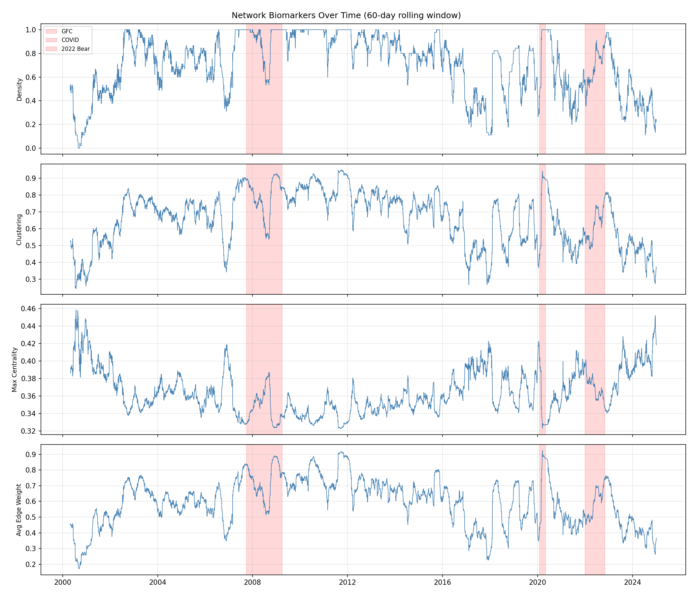
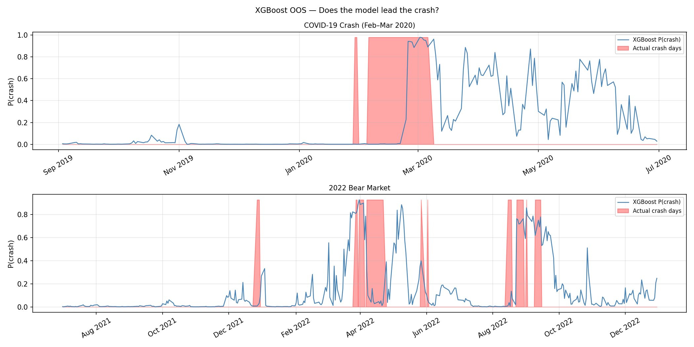
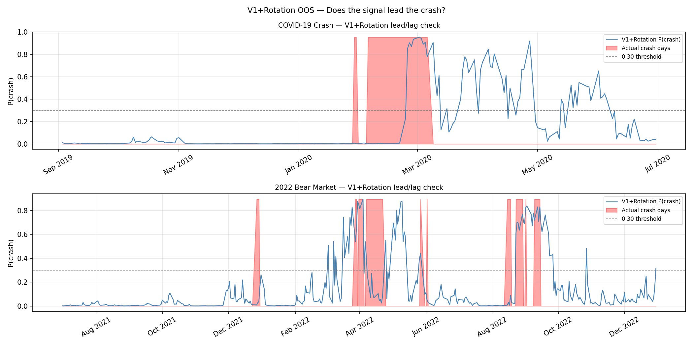
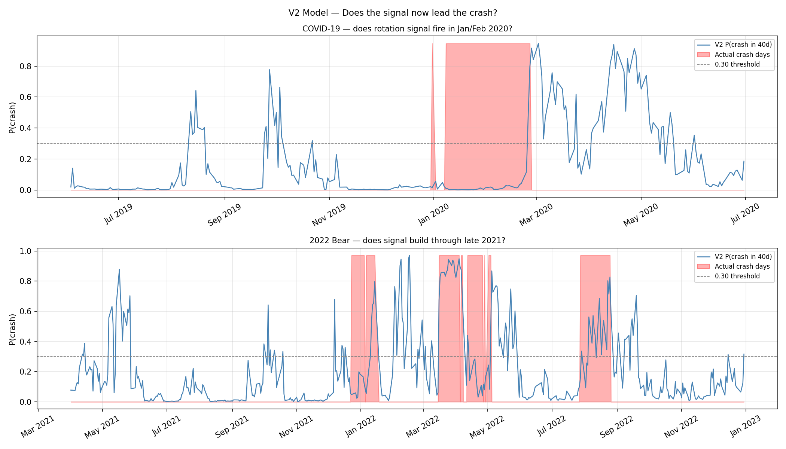
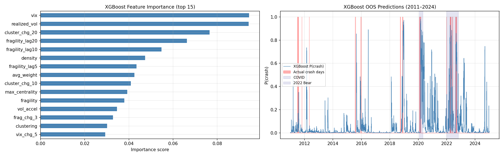
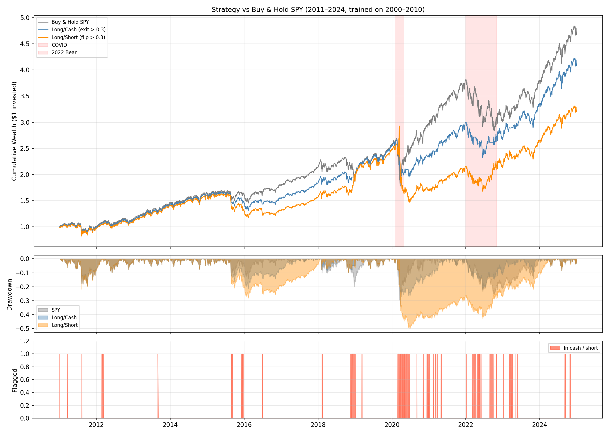
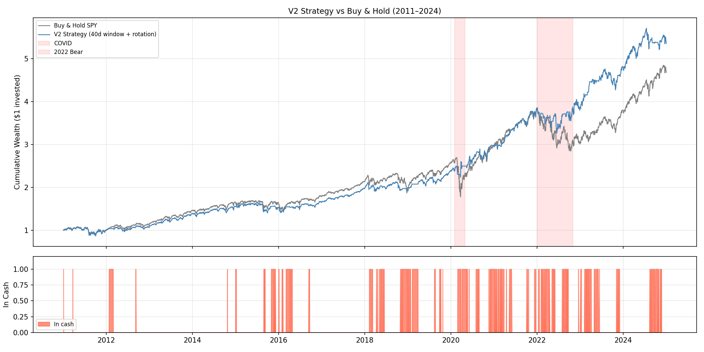

# Network-Based Early Warning System for Equity Market Crashes

- **Status:** Co-authored, under journal review
- **Tools:** Python (Pandas, NumPy, scikit-learn, XGBoost)

## Overview
Built a Composite Fragility Score from four network biomarkers (density, average edge
weight, clustering, maximum eigenvector centrality) extracted from rolling cross-sector
correlation matrices across 10 S&P 500 sectors (2000–2024). Tested logistic regression,
XGBoost, and a sector-rotation overlay for out-of-sample equity crash prediction, trained
on 2000–2010 and tested on 2011–2024 to avoid look-ahead bias.

## Biomarker Behavior During Crisis Periods

*Network density, edge weight, and clustering all rise sharply during the 2007–09
Global Financial Crisis, the 2020 COVID shock, and the 2022 bear market, confirming the
biomarkers respond to genuine market stress rather than noise.*

## Predictive Model Results

| Model | Out-of-Sample AUC |
|---|---|
| VIX-only benchmark | 0.6449 |
| Baseline logit (network biomarkers + VIX) | 0.6693 |
| XGBoost V1 | 0.7009 |
| XGBoost V1 + Sector Rotation (20-day horizon) | **0.7264** |
| XGBoost V2 (40-day horizon, earlier warning) | 0.6030–0.6528* |

XGBoost V1+Rotation was the strongest specification overall. Feature importance confirms
network biomarkers (clustering, edge weight, density) rank alongside VIX and realized
volatility as top predictors.

*V1 fires contemporaneously with the COVID shock but builds visibly ahead of the 2022
bear market — better at catching slow-building stress than sudden exogenous shocks.*

*Adding the sector rotation signal improves timing during the 2022 bear market, building
several weeks ahead of the crash clusters.*

*V2 fires earliest — crossing threshold in late 2019, ahead of both V1 and V1+Rotation —
but with more false positives during calm periods.*

*VIX and realized volatility dominate, but network biomarker derivatives consistently
rank in the top 15 features.*

## Trading Strategy and Backtest Performance
Each strategy holds SPY when predicted crash probability is below 0.30, moves to cash at
or above 0.30, using only prior-day signals to avoid look-ahead bias.

| Strategy | Sharpe Ratio | Max Drawdown |
|---|---|---|
| Buy-and-hold SPY | 0.68 | 33.93% |
| V1 Long/Cash | **0.72** | **26.80%** |
| V1+Rotation Long/Cash | 0.65 | 32.07% |
| V2 Long/Cash | 0.90 | 19.39% |
| V1 Long/Short | 0.50 | −50.21% |

*The Long/Cash strategy steps aside visibly during COVID and the 2022 bear market,
producing shallower drawdowns; the Long/Short variant underperforms throughout.*

*V2 runs slightly below SPY from 2011–2019 before pulling ahead from 2020 onward.*

Despite V1+Rotation having the strongest predictive AUC, it does *not* produce the best
trading outcome — a key finding that prediction accuracy and economic value don't always
move together.

## Files
- `Network_Crash_Early_Warning.pdf` — full paper
- `Network_Crash_Model_Code.html` — model code (fragility score, XGBoost, backtest)

[← Back to Quant Research Projects](../)
